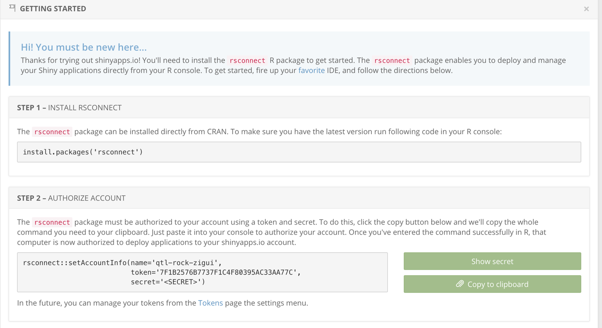
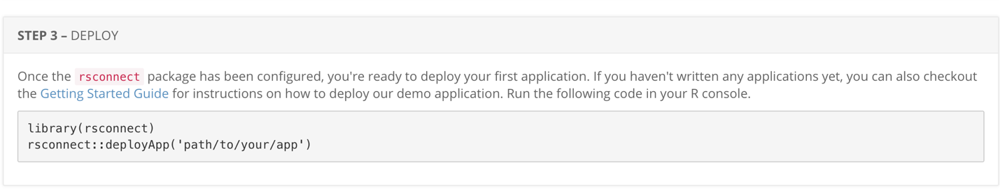
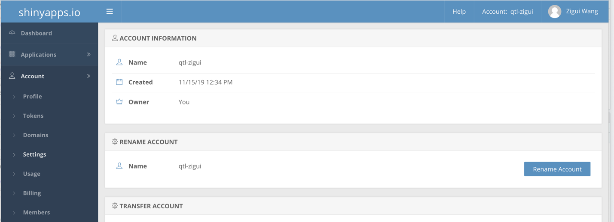

# Shiny app deployment

1. Download ShinyJWAS from [https://github.com/QTL-rocks/ShinyJWAS.git](https://github.com/QTL-rocks/ShinyJWAS.git).
2. Install all dependency packages in R.

    ```r
    install.packages("devtools")
    library(devtools)
    install_github("luansheng/visPedigree"
    ```

3. Set up an account in shinapps.io: [https://www.shinyapps.io/admin/#/signup](https://www.shinyapps.io/admin/#/signup)
4. After logging in, follow these steps shown in the tutorial.



5. Deploy the app:  step 3 in the tutorial shows how to deploy the shiny app by R



6. Account name:

The website name depends on the Account name of the shinapps account.

Website url: [https://Account-name.shinyapps.io/shiny_app/](https://account-name.shinyapps.io/shiny_app/). For example, if my account name is qtl-zigui, then the url of shiny app I deploy will be [https://qtl-zigui.shinyapps.io/shiny_app/](https://qtl-zigui.shinyapps.io/shiny_app/). The account name can be changed in the Settings of the Account section on the left panel.


