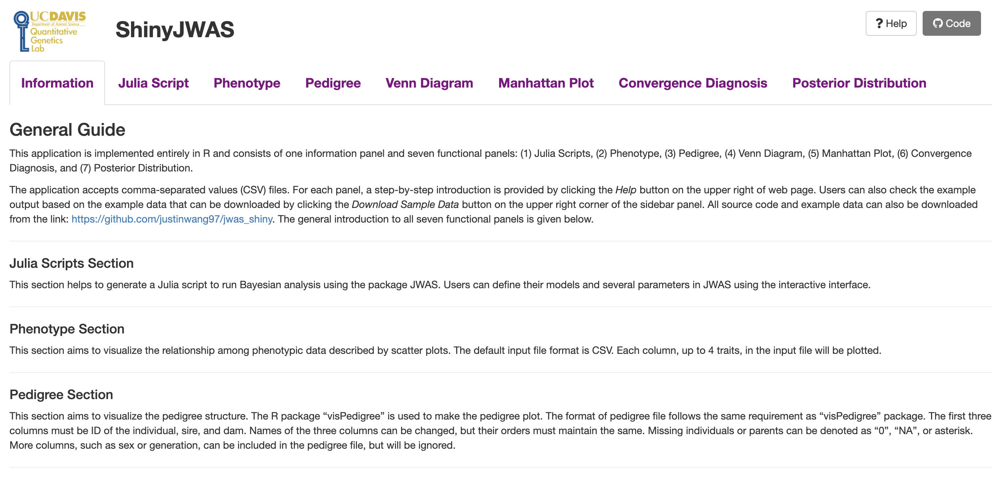

# Summary

ShinyJWAS is a shiny web application [@shiny] to help users to perform whole-genome Bayesian regression analysis with JWAS package [@JWAS], a well-documented software platform based on Julia and the interactive Jupyter notebook for analyses of general univariate and multivariate Bayesian mixed effects models.  With the easy-to-use graphical user interface (GUI) (\autoref{shiny_image}), ShinyJWAS provides users a complete tutorial to the JWAS package for Bayesian analysis and a number of options to manage, explore, and visualize the data. The application provides interactive interfaces to generate scripts to run Bayesian analysis in JWAS, visualize phenotypic data, pedigree structure, and posterior distributions of parameters of interest, e.g., heritability, make Manhattan plot from GWAS, and perform convergence diagnosis of MCMC samples.

In conclusion, functions in ShinyJWAS free users from scripting by automating the Bayesian analysis process and provide interactive interfaces for data summarization, visualization, and diagnostic tests. More detailed documentation and tutorials can be found on the shiny app page: https://zigwang.shinyapps.io/shiny_app/.

# Acknowledgements

This work was supported by the United States Department of Agriculture, Agriculture and Food Research Initiative National Institute of Food and Agriculture Competitive grant no. 2018-67015-27957.

# References